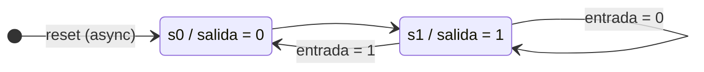

# Ejercicio 13 — Análisis

## Comportamiento del circuito

El circuito es una **máquina de estados finitos tipo Moore de dos estados** (`s0`, `s1`) con un reset que fuerza el estado a `s0`. La salida sólo depende del estado actual:

- En `s0`: `salida = '0'`
- En `s1`: `salida = '1'`

### Transiciones

| Estado actual | `reset` | `entrada` | Próximo estado    |
|---------------|---------|-----------|-------------------|
| cualquiera    | 1       | x         | `s0` (forzado)    |
| `s0`          | 0       | x         | `s1` (incondic.)  |
| `s1`          | 0       | 0         | `s1` (se mantiene) |
| `s1`          | 0       | 1         | `s0`               |

Mientras `entrada = '0'`, la máquina se queda atrapada en `s1` luego del primer flanco. Cuando `entrada = '1'`, oscila entre `s1` y `s0` en cada flanco de reloj (en `s1` salta a `s0`, y desde `s0` siempre vuelve a `s1`), produciendo en `salida` un tren de pulsos a la mitad de la frecuencia del reloj.

## Diagrama de estados (Moore)

Notación de las aristas: `entrada`. La salida está dentro del nodo porque es Moore.



El reset asíncrono se dispara desde cualquier estado, no sólo en el arranque; se omite del diagrama por claridad (sería una flecha desde cada estado hacia `s0`).

## ¿El reset es sincrónico o asincrónico?

**Asincrónico** — el patrón estructural del código corresponde a un reset asíncrono:

```vhdl
process (clk)
begin
    if reset = '1' then
        state <= s0;
    elsif rising_edge(clk) then
        ...
    end if;
end process;
```

La rama `if reset = '1' then` aparece **fuera** del `rising_edge(clk)`, lo que indica al sintetizador que el borrado debe activarse independientemente del flanco de reloj. Quartus mapea esto al pin asíncrono de clear/preset del flip-flop, lo que en hardware significa que cuando `reset = '1'` la salida vuelve a `'0'` inmediatamente, sin esperar al próximo flanco.

### Detalle a tener en cuenta: la lista de sensibilidad está incompleta

El proceso declara `process (clk)` pero no incluye `reset`. Esto es **inconsistente** con la intención de reset asíncrono:

- **En el hardware sintetizado** (lo que efectivamente corre en el FPGA y lo que muestra la simulación post-fitter): Quartus reconoce el patrón estructural e infiere un reset asíncrono real. El `reset` actúa en el momento.
- **En una simulación VHDL estricta basada únicamente en la lista de sensibilidad** (algunos simuladores externos): el proceso sólo se evaluaría con cambios de `clk`, lo que efectivamente convertiría al reset en sincrónico — un cambio de `reset` entre dos flancos de reloj pasaría inadvertido hasta el siguiente flanco.

La forma correcta de escribirlo sería:

```vhdl
process (clk, reset)
```

así la simulación funcional y el hardware coinciden. La omisión es un *bug* sutil que en la práctica suele quedar oculto porque la simulación funcional de Quartus se basa en el netlist sintetizado (donde el reset ya quedó asíncrono).

## Notas sobre la simulación

El `.vwf` provisto exhibe los dos comportamientos:

- **0 – 50 ns:** `reset = '1'` → arranca en `s0`, `salida = '0'`.
- **50 – 300 ns:** `reset = '0'`, `entrada = '0'` → primer flanco lleva a `s1`; queda atrapado en `s1`, `salida = '1'` constante.
- **300 – 600 ns:** `entrada = '1'` → `salida` empieza a oscilar (alterna `0` y `1` en cada ciclo de reloj).
- **600 – 650 ns:** segundo pulso de `reset = '1'` → vuelve a `s0`, `salida = '0'` (efecto inmediato si el reset se sintetizó asíncrono).
- **650 – 1000 ns:** `reset = '0'`, `entrada = '1'` → la oscilación se reanuda.
