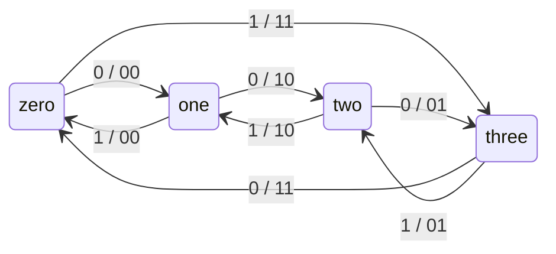

# Ejercicio 6 — Análisis

## Comportamiento del circuito

El circuito es una **máquina de estados finitos tipo Mealy** que implementa un **contador up/down de 2 bits** sobre cuatro estados enumerados (`zero`, `one`, `two`, `three`):

- Con `updown = '0'` cuenta hacia adelante: `zero → one → two → three → zero …`
- Con `updown = '1'` cuenta hacia atrás: `zero → three → two → one → zero …`

El estado se actualiza en el flanco ascendente de `clock` y la salida se entrega como dos señales `std_logic` separadas (`lsb`, `msb`) que, leídas como un valor de 2 bits, codifican un número entre 0 y 3.

## Tipo de máquina: Mealy

Es **Mealy** y no Moore porque la salida (`lsb`, `msb`) se calcula dentro del mismo proceso combinacional que la lógica de próximo estado y **depende de la entrada `updown` además del estado presente**.

Por ejemplo, en el estado `zero`:

- Si `updown = '0'`, la salida es `00`.
- Si `updown = '1'`, la salida es `11`.

Distinta salida para el mismo estado → la salida depende también de la entrada → Mealy.

En una versión Moore, la salida sólo dependería del estado y existiría una etiqueta de salida única por nodo del diagrama (típicamente sobre el nodo en lugar de sobre las transiciones).

## Diagrama de estados

Notación de las aristas: `updown / lsb msb`.

## Tabla de transiciones y salidas

| Estado actual | `updown` | Próximo estado | `lsb` | `msb` |
|---------------|----------|----------------|-------|-------|
| zero          | 0        | one            | 0     | 0     |
| zero          | 1        | three          | 1     | 1     |
| one           | 0        | two            | 1     | 0     |
| one           | 1        | zero           | 0     | 0     |
| two           | 0        | three          | 0     | 1     |
| two           | 1        | one            | 1     | 0     |
| three         | 0        | zero           | 1     | 1     |
| three         | 1        | two            | 0     | 1     |

### Patrón de la salida

Leyendo `(msb,lsb)` como un número binario de 2 bits:

- Cuando `updown = '0'` (cuenta para arriba): la salida coincide con el **valor del estado presente**.
- Cuando `updown = '1'` (cuenta para abajo): la salida coincide con el **valor del próximo estado**.

En ambos casos la salida representa la "cuenta más baja" entre el estado presente y el próximo, lo que es coherente con un contador up/down visto como Mealy.

## Recursos sintetizados

Del reporte `output_files/ejercicio6.map.rpt`:

| Recurso                          | Cantidad |
|----------------------------------|----------|
| Funciones combinacionales        | 6        |
| LUTs de 4 entradas               | 1        |
| LUTs de 3 entradas               | 5        |
| Registros (flip-flops)           | 4        |

Llaman la atención los **4 registros** para una máquina de sólo 4 estados (con codificación binaria alcanzarían 2). Quartus II 13.0sp1, por defecto, sintetiza las máquinas con tipo enumerado usando codificación **one-hot** (un flip-flop por estado), porque suele dar mejor performance que la codificación binaria sobre arquitecturas FPGA con LUTs y registros abundantes. La codificación puede cambiarse desde *Assignments → Settings → Analysis & Synthesis Settings → State Machine Processing*.
